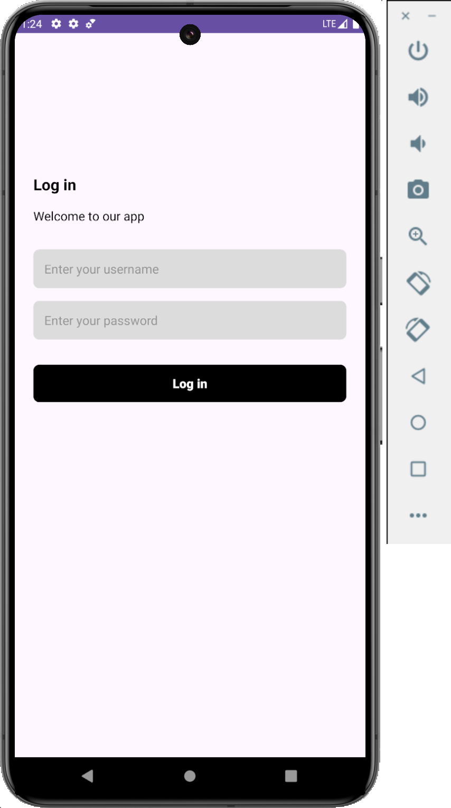
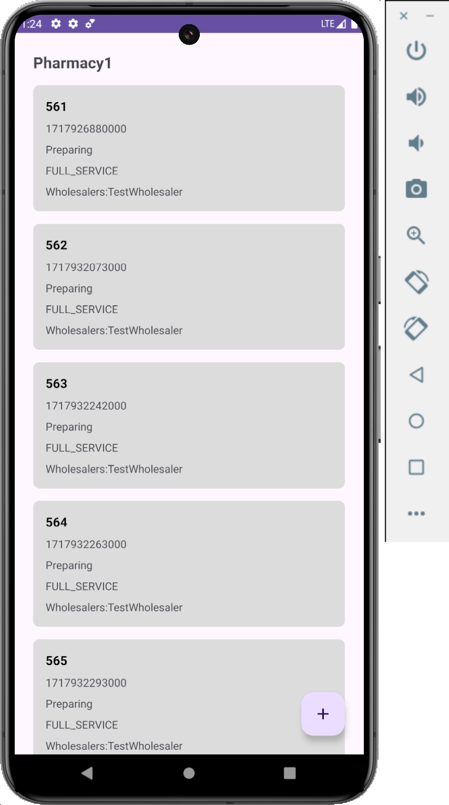
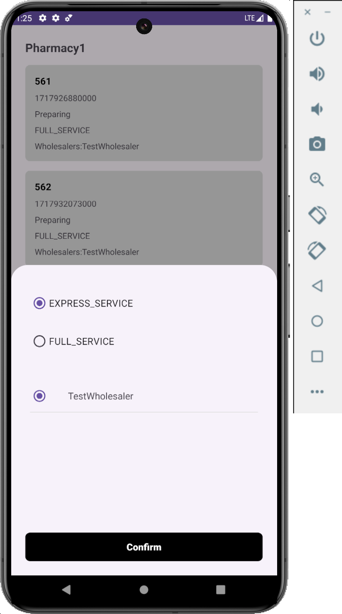
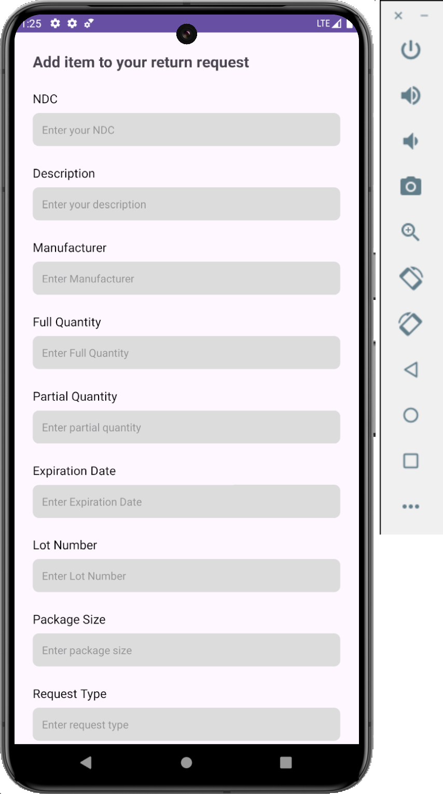
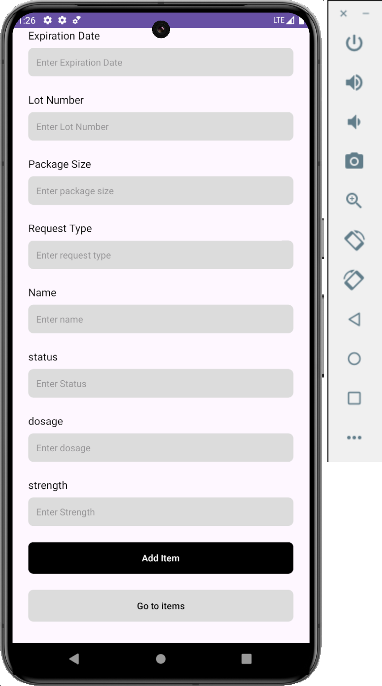
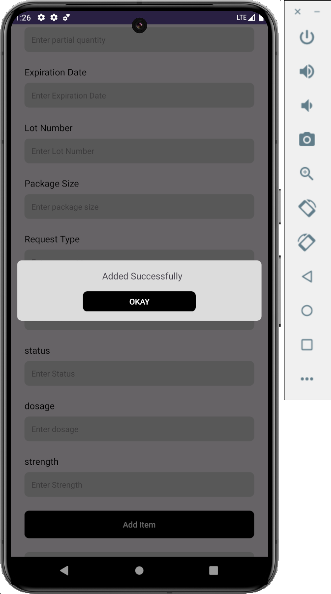
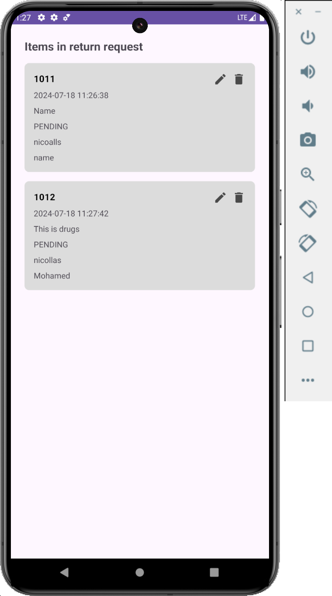
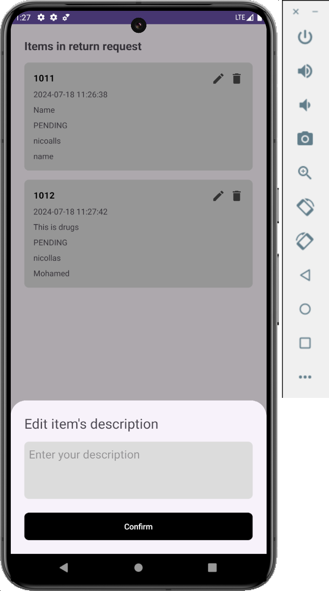
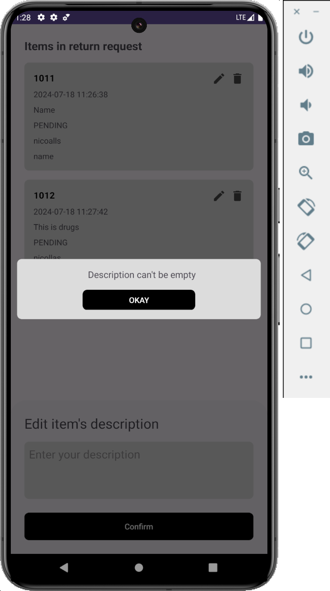
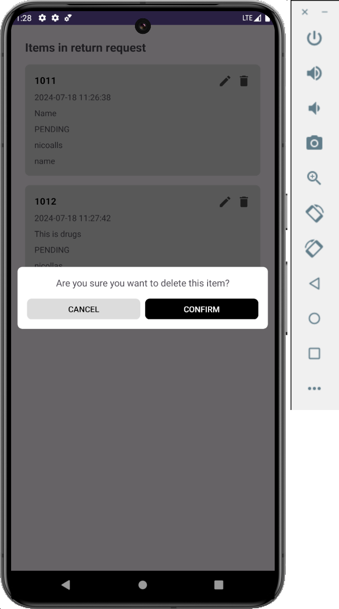

# YomicepaTask
 Pharmacy platform you can find the link to download the latest APK:

[Download APK](app/release/app-release.apk)

# Technologies:

- Navigation Component
- Kotlin Cououtines
- kotlin Flows
- Retrofit
- Hilt
- Clean architecture
- sharedViewModel

# Screenshots: 

